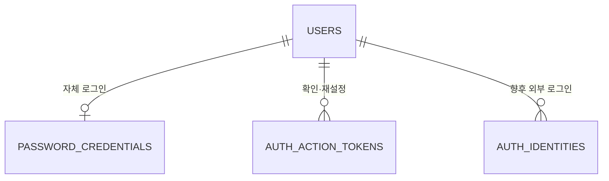

# 한달살림 인증 데이터 스키마 초안

> 상태: Draft — 이메일·비밀번호 방식과 비밀번호 규칙만 사용자 선택. 관련 인증 기능의 migration 직전에 필요한 미결정 사항을 확정한다.
>
> 기준: `SERVICE_PLAN.md` 0.8, `docs/01-plan/schema.md`, `docs/02-design/auth-policy.md`
>
> 범위: 자체 로그인 자격 증명, 이메일 확인·비밀번호 재설정 링크, 서버 세션의 데이터 책임

## 1. 용어와 경계

| 용어 | 의미 |
|---|---|
| 사용자 | 공간·거래가 참조하는 안정적인 내부 `users.id` (UUID) |
| 자체 로그인 자격 증명 | 사용자의 이메일 로그인 주소와 비밀번호 해시. 외부 로그인 식별자와 별개 |
| 인증 작업 링크 | 이메일 확인 또는 비밀번호 재설정을 한 번 수행할 수 있는 만료형 토큰 |
| 서버 세션 | 로그인 상태를 서버에서 관리하는 인프라 데이터. 브라우저에는 세션 쿠키만 전달 |

`users.id`는 이메일 변경이나 향후 로그인 수단 추가와 관계없이 유지한다. 기존 `auth_identities`는 향후 외부 로그인 수단 전용이며, 이메일·비밀번호를 그 테이블의 `issuer`/`subject`에 억지로 넣지 않는다. 인증 데이터는 공간 소유 데이터가 아니므로 `space_id`를 갖지 않는다. 업무 API는 세션의 사용자 ID와 활성 공간 멤버십을 모두 확인한다.

## 2. 관계

`users`는 가입 때 만들되, 이메일 미확인 상태는 `users.status`에 새 값을 더하지 않고 자격 증명의 `email_verified_at IS NULL`로 판단하는 안이다. 확인 전에는 공간·거래 API 접근을 차단한다. `users.display_name NOT NULL`이므로 가입 때 표시 이름을 받는 안을 추천한다. 이 입력 시점은 아직 제품 결정이 아니다.

## 3. `password_credentials` (제안)

사용자 한 명에 자체 로그인 자격 증명은 최대 한 건이다. 비밀번호는 원문이나 복호화 가능한 값으로 보관하지 않는다.

| 필드 | PostgreSQL 타입 | 필수 | 제약/설명 |
|---|---|---:|---|
| `user_id` | `uuid` | Y | PK, FK → `users.id` |
| `email_address` | `varchar(254)` | Y | 메일 발송·표시용 원본 주소. 앞뒤 공백 제거 후 저장 |
| `email_lookup_key` | `varchar(254)` | Y | 로그인·중복 검사 전용 비교 키. 생성 규칙은 승인 필요 |
| `password_hash` | `varchar(512)` | Y | 알고리즘·비용 정보를 포함한 적응형 해시 인코딩 값 |
| `email_verified_at` | `timestamptz` | N | 최초 이메일 소유 확인 시각 |
| `password_changed_at` | `timestamptz` | Y | 초기 설정 및 마지막 변경 시각 |
| `created_at` | `timestamptz` | Y | 생성 시각 |
| `updated_at` | `timestamptz` | Y | 변경 시각 |
| `version` | `bigint` | Y | 동시 변경 감지, 기본값 0 |

- UNIQUE: `email_lookup_key`. 조회·가입이 경쟁해도 데이터베이스 제약이 중복 계정 생성을 막는다.
- 이메일 주소는 계정 식별·발송에만 사용하고 공개 프로필이나 공간 멤버 목록에 기본 노출하지 않는다.
- 조회 키의 대소문자·국제화 처리 정책을 확정하기 전에는 이 필드의 생성 코드나 migration을 작성하지 않는다. 원본 보존, 도메인 소문자화, 서비스가 지원하는 로컬 부분의 비교 규칙을 명시해야 한다. Gmail식 점 제거·`+` 별칭 제거를 모든 주소에 적용하지 않는다.
- 이메일 변경, 여러 이메일 추가, 탈퇴 후 주소 재사용은 이 초안의 범위 밖이며 별도 정책이 필요하다.

## 4. `auth_action_tokens` (제안)

링크 원문은 난수로 발급해 사용자에게만 전달하고 서버에는 검증용 해시만 저장한다. 비밀번호 해시와 달리 충분히 긴 무작위 토큰의 단방향 지문으로 조회할 수 있다.

| 필드 | PostgreSQL 타입 | 필수 | 제약/설명 |
|---|---|---:|---|
| `id` | `uuid` | Y | PK, 서버 생성 |
| `user_id` | `uuid` | Y | FK → `users.id` |
| `purpose` | `varchar(20)` | Y | `EMAIL_VERIFY`, `PASSWORD_RESET`만 허용 |
| `token_hash` | `bytea` | Y | 원문을 저장하지 않는 검증용 해시 |
| `expires_at` | `timestamptz` | Y | 사용 가능 종료 시각 |
| `consumed_at` | `timestamptz` | N | 성공적으로 사용한 시각 |
| `revoked_at` | `timestamptz` | N | 재발급 등으로 폐기한 시각 |
| `created_at` | `timestamptz` | Y | 발급 시각 |

- UNIQUE: `token_hash`. INDEX: `(user_id, purpose)`.
- 제안 제약: 사용자·목적별 미사용·미폐기 토큰은 최대 한 건. 만료된 이전 토큰도 재발급 트랜잭션에서 폐기해 부분 UNIQUE 인덱스와 충돌하지 않게 한다.
- 사용 시 `purpose`, 만료, 사용·폐기 여부를 확인하고 소비 처리를 한 트랜잭션에서 수행한다. 두 요청이 동시에 같은 링크를 사용해도 성공은 한 번뿐이어야 한다.
- 링크 재발급은 앞선 같은 목적의 링크를 폐기한다. 비밀번호 재설정은 확인된 이메일에만 발급하고, 계정 존재 여부를 응답에서 드러내지 않는다.
- 승인 대기인 인증 정책의 제안 만료값은 확인 24시간, 재설정 30분이다. 값이 바뀌어도 테이블 구조는 유지된다.
- 사용·만료·폐기된 행은 악용 조사와 개인정보 최소 보존의 균형을 고려해 별도 보존 기간을 정한 뒤 정리한다. 무기한 보존하지 않는다.

## 5. 세션과 생명주기

세션은 Spring Session JDBC가 관리하는 인프라 테이블(`SPRING_SESSION`, `SPRING_SESSION_ATTRIBUTES`)에 둔다. 해당 버전의 공식 DDL을 검토해 Flyway로 관리하고, 업무 ERD의 자체 인증 토큰 테이블과 섞지 않는다. 세션 ID 원문과 비밀번호는 애플리케이션 로그에 기록하지 않는다.

- 가입: `users`와 `password_credentials`를 함께 생성한다. 이메일 발송 실패·재시도 처리는 계정 중복과 링크 중복을 만들지 않아야 한다.
- 이메일 확인: 링크를 한 번 소비하고 `email_verified_at`을 기록한다. 확인 전 업무 API는 거부한다.
- 로그인: 확인된 활성 사용자에게만 새 서버 세션을 부여한다. 로그인 성공 시 세션 ID를 갱신한다.
- 비밀번호 재설정: 링크 소비, 해시 변경, 기존 세션 무효화를 일관되게 처리한다. 기존 비밀번호로는 다시 로그인할 수 없다.
- 로그아웃: 해당 서버 세션을 무효화한다. 쿠키 만료만으로 처리하지 않는다.
- 추천 세션 정책의 미사용 7일과 로그인 후 절대 최대 30일은 별개다. JDBC 세션의 일반 만료 설정만으로 절대 만료가 충족된다고 가정하지 않고 생성 시각 기준 검사를 설계·검증한다.
- 계정 탈퇴 시 자격 증명·인증 링크·세션 정리와 공동 공간 데이터의 보존·소유권 처리는 함께 정책을 정한다. 도메인 금융 기록에 무조건적인 연쇄 삭제를 설정하지 않는다.

## 6. 구현 전 검증 항목

- 동일 이메일 동시 가입은 사용자·자격 증명 쌍 하나만 만들고, 실패한 가입으로 고아 `users` 행을 남기지 않는다.
- 이메일 비교 규칙의 대소문자·국제화·별칭 사례를 고정된 테스트 데이터로 검증한다.
- 미확인 사용자는 세션이 있더라도 공간 생성과 거래 API를 사용할 수 없다.
- 확인·재설정 링크의 위조·만료·재사용·동시 사용·재발급 후 이전 링크 사용은 실패한다.
- 비밀번호 재설정 뒤 기존 세션과 이전 비밀번호가 모두 거부된다.
- 서버 재시작 후 유효 세션은 유지되고, 미사용 기간과 절대 만료 중 먼저 도달한 시점에 거부된다.
- 다른 사용자의 `user_id`, `space_id`를 요청에 넣어도 인증·멤버십 우회가 불가능하다.
- 로그와 오류 응답에 비밀번호, 토큰 원문, 전체 이메일, 세션 ID가 나오지 않는다.

## 7. 승인 대기 결정

| ID | 결정 | 추천안 | 이유 |
|---|---|---|---|
| AUTH-DATA-01 | 표시 이름 입력 시점 | 가입 때 이메일·비밀번호와 함께 받기 | 기존 `users.display_name NOT NULL` 유지 |
| AUTH-DATA-02 | 이메일 중복 판정 | 원본은 보존하고 별도 비교 키를 사용하되, 로컬 부분 대소문자·국제화 규칙을 명시적으로 확정 | 계정 충돌과 로그인 혼란 방지 |
| AUTH-DATA-03 | 사용한 인증 링크 보존 기간 | 운영·보안 요구를 정한 뒤 확정 | 감사와 개인정보 최소 보존 균형 |

`docs/02-design/auth-policy.md`의 AUTH-02~06도 기능별 결정 대기다. 전체 인증 정책의 일괄 확정은 요구하지 않는다. 자격 증명·확인·재설정·세션 중 실제로 구현하는 부분에 필요한 결정만 먼저 확정한다. 다른 기능과 프로젝트 초기화는 이 초안 때문에 중단하지 않는다.

## 8. 근거

- [OWASP 이메일 검증 및 확인](https://cheatsheetseries.owasp.org/cheatsheets/Email_Validation_and_Verification_Cheat_Sheet.html)
- [OWASP 비밀번호 재설정](https://cheatsheetseries.owasp.org/cheatsheets/Forgot_Password_Cheat_Sheet.html)
- [Spring Security 비밀번호 저장](https://docs.spring.io/spring-security/reference/features/authentication/password-storage.html)
- [Spring Session JDBC](https://docs.spring.io/spring-session/reference/configuration/jdbc.html)
