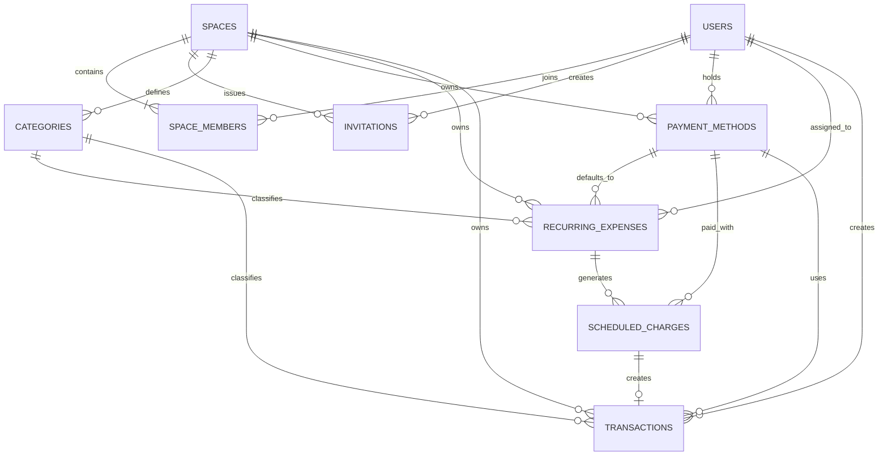

# 한달살림 핵심 ERD

> 상태: Draft
>
> 이 ERD는 MVP의 개념 관계 초안이다. 필드와 제약의 상세 기준은 `schema.md`를 따른다.



## 핵심 관계

```text
사용자 1 ── * 공간 멤버십 * ── 1 관리 공간

관리 공간 1 ── * 반복 고정비 설정
반복 고정비 설정 1 ── * 예정 청구
예정 청구 1 ── 0..1 자동 생성 거래

관리 공간 1 ── * 직접 입력 거래
사용자 1 ── * 개인 거래
```

## 경계 원칙

- 모든 업무 데이터는 `space_id`를 통해 하나의 관리 공간에 속한다.
- 혼자 관리와 함께 관리는 서로 다른 테이블이 아니라 활성 멤버 수와 공간 상태로 구분한다.
- 예정 청구는 반복 고정비 설정의 당시 정보를 스냅샷으로 보존한다.
- 자동 생성 거래는 `scheduled_charge_id`를 유일하게 참조하여 1:1 관계를 보장한다.
- 개인 거래의 존재 여부와 내용은 작성자 이외의 멤버에게 노출하지 않는다.
