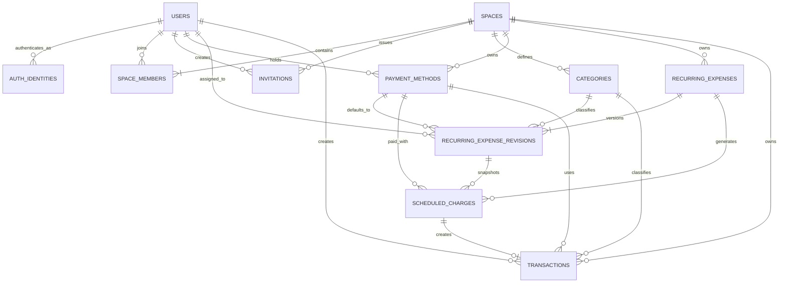

# 한달살림 핵심 ERD

> 상태: Draft
>
> 이 ERD는 MVP의 개념 관계 초안이다. 필드와 제약의 상세 기준은 `schema.md`를 따른다.



## 핵심 관계

```text
사용자 1 ── * 공간 멤버십 * ── 1 관리 공간

관리 공간 1 ── * 반복 고정비 설정
반복 고정비 설정 1 ── * 반복 설정 revision
반복 고정비 설정 1 ── * 예정 청구
예정 청구 1 ── 0..1 자동 생성 거래

관리 공간 1 ── * 직접 입력 거래
사용자 1 ── * 개인 거래
```

## 경계 원칙

- 모든 업무 데이터는 `space_id`를 통해 하나의 관리 공간에 속한다.
- 공간 소유 엔티티 사이의 참조는 `(id, space_id)` 복합 FK로 다른 공간의 데이터 연결을 차단한다.
- 혼자 관리와 함께 관리는 서로 다른 테이블이 아니라 활성 멤버 수와 공간 상태로 구분한다.
- 사용자와 외부 인증 주체는 분리하며 도메인 데이터는 내부 사용자 ID만 참조한다.
- 반복 설정 변경은 적용 예정일별 revision으로 기록한다.
- 예정 청구는 적용된 revision과 당시 정보를 스냅샷으로 보존한다.
- 자동 생성 거래는 `scheduled_charge_id`를 유일하게 참조하여 1:1 관계를 보장한다.
- 완료 취소 후 재완료도 같은 자동 생성 거래 행의 상태를 전환한다.
- 개인 거래의 존재 여부와 내용은 작성자 이외의 멤버에게 노출하지 않는다.

## 미래 금융 연동 경계

```text
외부 금융 연결 1 ── * 외부 카드·계좌
외부 카드·계좌 1 ── * 수집 거래
수집 거래 1 ── 0..1 거래 매칭 ── 0..1 예정 청구 또는 실제 거래
```

금융 연동 엔티티는 MVP ERD에 포함하지 않는다. 외부에서 수집한 승인 대기·확정·삭제 거래를 핵심 `transactions`에 바로 넣지 않고 별도 수집 계층에서 멱등 저장하고 매칭한다.
