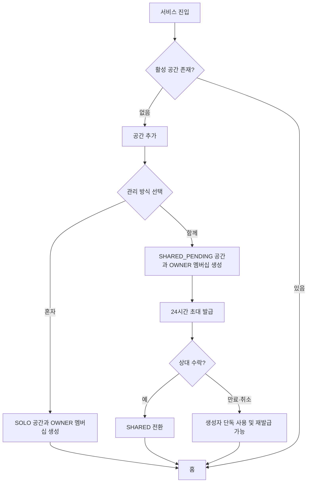
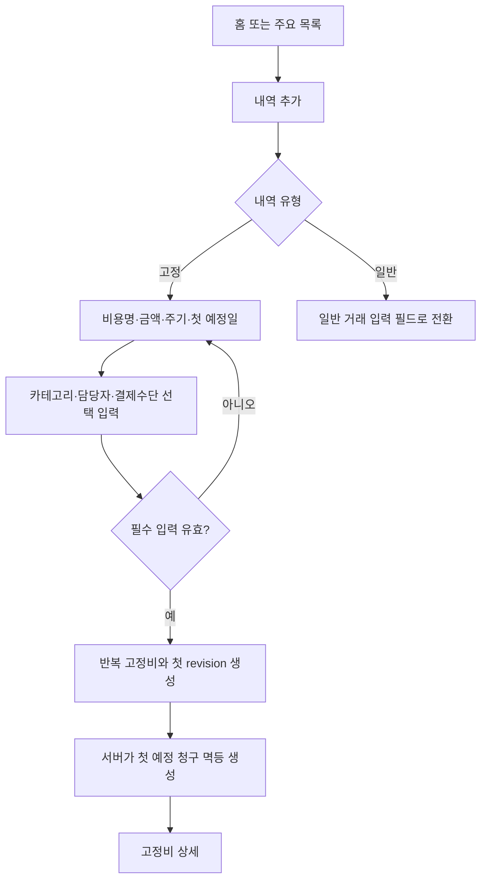
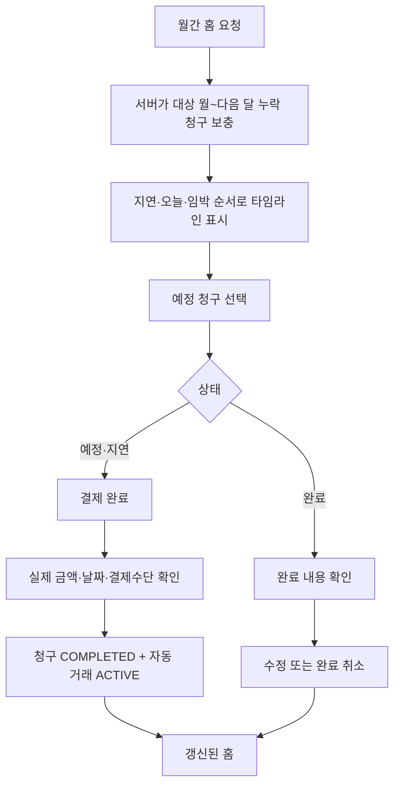
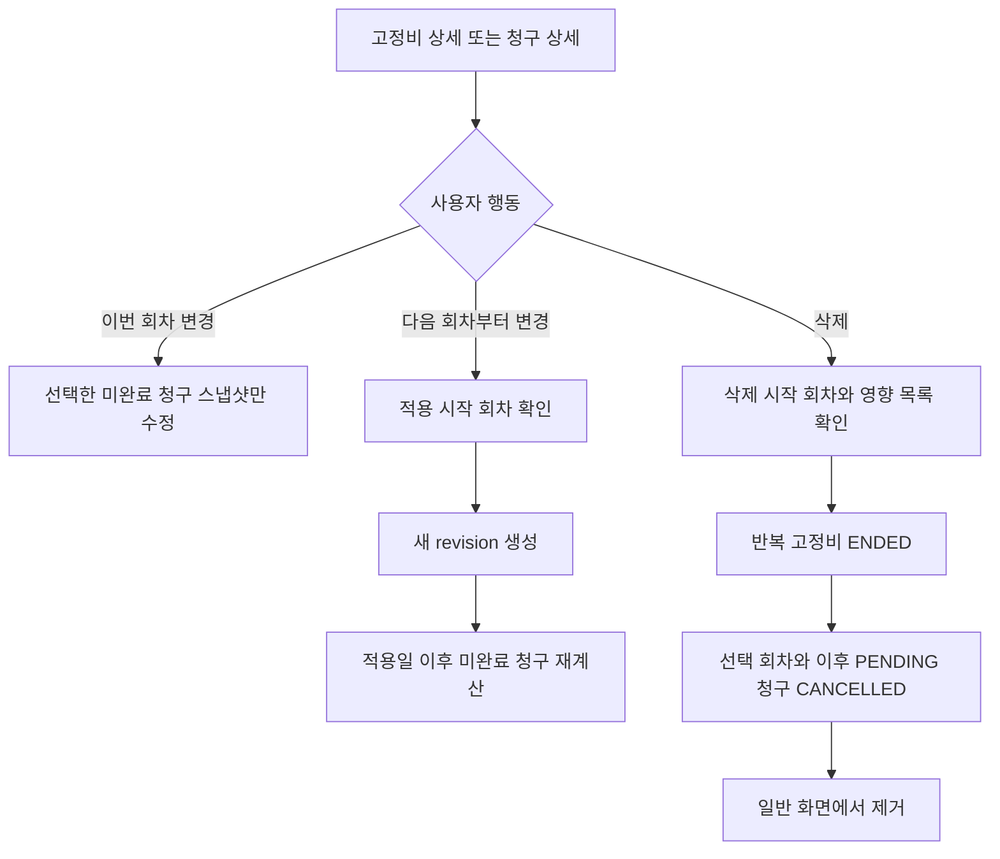
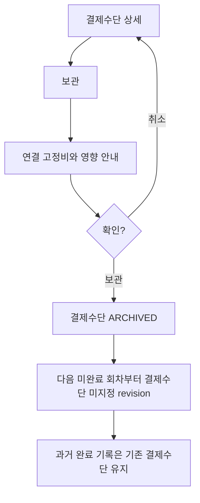
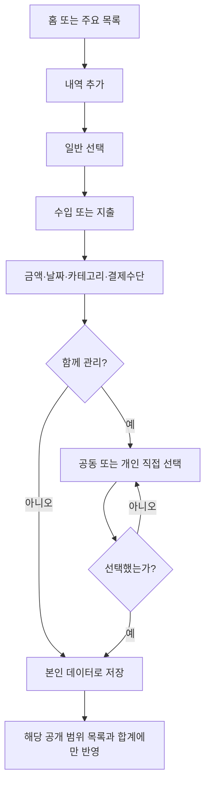
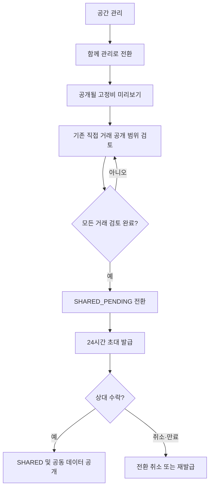

# 한달살림 MVP 사용자 흐름

> 상태: Draft — 사용자 승인 전 구현 기준으로 사용하지 않음
>
> 로그인·인증 완료 후의 제품 흐름만 다룬다.

## 1. 첫 공간 생성

관리 방식에는 기본 선택값을 두지 않는다.

## 2. 첫 고정비 등록

카테고리, 담당자와 결제수단은 고정비 등록을 막지 않는다. 입력하지 않은 값은 `미지정`으로 보여주며 고정비 상세에서 나중에 보완한다. 결제 완료 시에는 실제 결제수단을 필수로 선택한다.

## 3. 월간 홈과 결제 완료

저장 버튼을 연속으로 누르거나 네트워크가 재시도되어도 같은 자동 거래 한 건만 존재해야 한다.

## 4. 고정비 변경과 삭제

- 완료된 과거 청구와 거래는 어떤 경로에서도 변경하지 않는다.
- MVP에는 한 회차만 삭제하는 흐름이 없다.

## 5. 결제수단 보관

대체 결제수단을 강제로 등록시키지 않는다. 결제 완료 시점에는 실제 결제수단을 필수로 선택한다.

## 6. 직접 거래 등록

상대 사용자의 개인 거래는 존재 여부, 건수와 금액까지 노출하지 않는다.

## 7. 혼자 관리에서 함께 관리로 전환

초대 수락 전에는 기존 거래를 상대에게 공개하지 않는다.

## 8. 실패와 복구

| 실패 | 사용자 경험 | 데이터 규칙 |
|---|---|---|
| 목록 조회 실패 | 기존 화면을 지우지 않고 오류와 다시 시도 제공 | 조회가 쓰기를 중복 생성하지 않음 |
| 완료 응답 유실 | 다시 시도 가능 | 같은 청구·거래 결과 반환 |
| 동시 수정 충돌 | 최신 값 안내 후 다시 확인 | `version`으로 덮어쓰기 방지 |
| 초대 만료 | 만료 안내와 재발급 진입 | 기존 token 재사용 차단 |
| 권한 상실 | 안전한 공통 오류와 홈 이탈 | 데이터 존재 여부 추가 노출 금지 |
| 결제수단 미지정 | 경고 배지와 선택 행동 | 완료 전 실제 결제수단 필수 |
